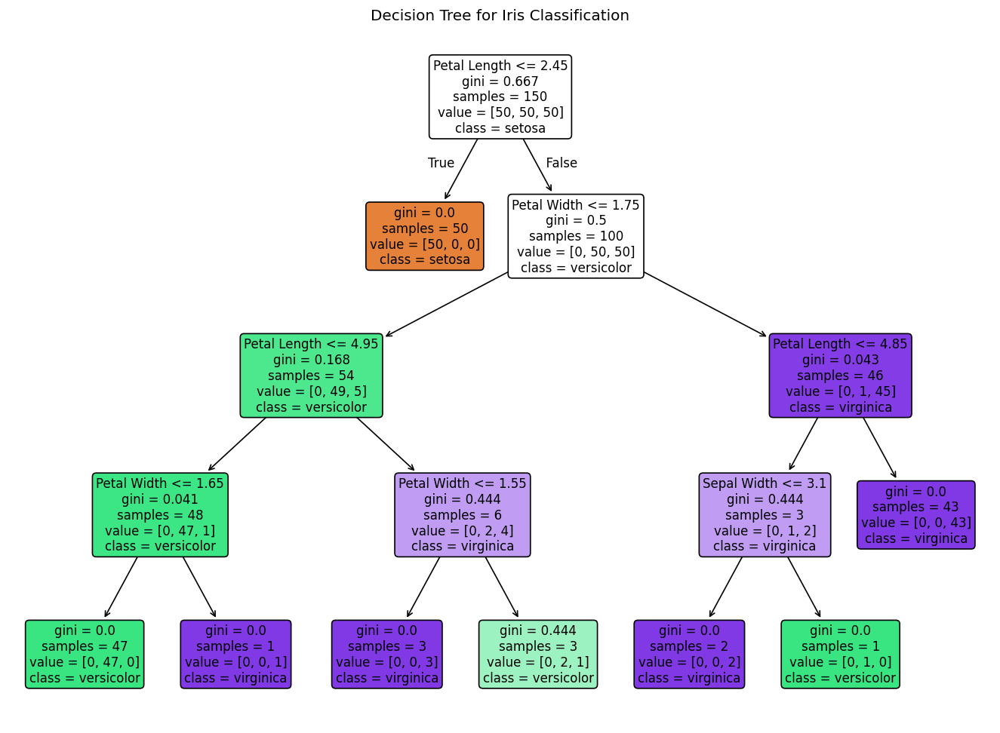
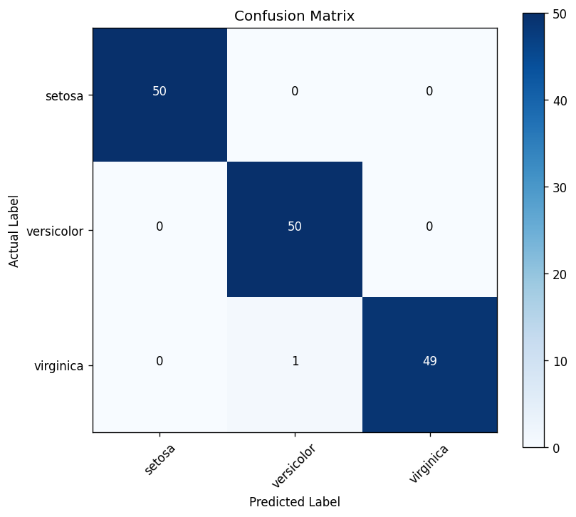

# Decision Tree Iris Classifier

A production-ready Flask application that trains and visualizes a Decision Tree classifier for the Iris dataset. Predict flower species instantly from measurements with a modern, responsive UI featuring real-time predictions, model accuracy display, and comprehensive ML visualizations.

**Status:** ✅ Fully functional | 🚀 Production-ready | 📱 Mobile-friendly

## Features

- ✅ Train a Decision Tree Classifier on the Iris dataset
- ✅ Predict Iris species from custom user input (sepal/petal measurements)
- ✅ Display model accuracy in real-time
- ✅ Show confusion matrix visualization
- ✅ Display decision tree structure visualization
- ✅ Responsive, modern dashboard design with gradient UI
- ✅ Instant prediction via AJAX (no page reload)
- ✅ Automatic model training on first run
- ✅ Error handling and input validation
- ✅ Cross-platform support (Windows, macOS, Linux)
- ✅ Mobile-friendly responsive layout
- ✅ Smooth animations and loading indicators

## Technologies Used

| Component | Technology |
|-----------|-----------|
| Backend | Flask 3.1.3, Python 3.9+ |
| ML Framework | Scikit-learn 1.0+ |
| Data Processing | Pandas 1.3+, NumPy 1.21+ |
| Visualization | Matplotlib 3.5+ |
| Frontend | HTML5, CSS3, Vanilla JavaScript |
| Version Control | Git, GitHub |


## Quick Start

```bash
# Clone or download the repository
cd DecisionTreeProject

# Create a virtual environment (recommended)
python -m venv venv

# Activate the environment
# Windows:
venv\Scripts\activate
# macOS / Linux:
source venv/bin/activate

# Install dependencies
pip install -r requirements.txt

# Run the Flask server
python app.py
```

**Access the application at:** `http://127.0.0.1:5000`

## Detailed Installation

### Prerequisites
- Python 3.9 or higher
- pip (Python package manager)
- Git (for version control)

### Step-by-step Setup

1. **Clone the repository:**
   ```bash
   git clone https://github.com/bhanuchippa/intership-task-1.git
   cd DecisionTreeProject
   ```

2. **Create a Python virtual environment:**
   ```bash
   python -m venv venv
   ```

3. **Activate the virtual environment:**
   - **Windows:**
     ```bash
     venv\Scripts\activate
     ```
   - **macOS / Linux:**
     ```bash
     source venv/bin/activate
     ```

4. **Install required packages:**
   ```bash
   pip install -r requirements.txt
   ```

5. **Run the application:**
   ```bash
   python app.py
   ```

6. **Open in browser:**
   Navigate to `http://127.0.0.1:5000`

## Usage

### Making Predictions

1. Enter the four Iris measurements:
   - **Sepal Length (cm):** Size of sepal in centimeters
   - **Sepal Width (cm):** Width of sepal in centimeters
   - **Petal Length (cm):** Length of petal in centimeters
   - **Petal Width (cm):** Width of petal in centimeters

2. Click **Predict Species** button

3. View the predicted Iris species and model accuracy

### Example Input Values

**For Setosa:**
- Sepal Length: 5.1, Sepal Width: 3.5, Petal Length: 1.4, Petal Width: 0.2

**For Versicolor:**
- Sepal Length: 7.0, Sepal Width: 3.2, Petal Length: 4.7, Petal Width: 1.4

**For Virginica:**
- Sepal Length: 6.3, Sepal Width: 3.3, Petal Length: 6.0, Petal Width: 2.5

## Model Information

- **Algorithm:** Decision Tree Classifier
- **Dataset:** Iris Flower Dataset (150 samples, 3 classes)
- **Features:** Sepal Length, Sepal Width, Petal Length, Petal Width
- **Classes:** Iris-setosa, Iris-versicolor, Iris-virginica
- **Max Depth:** 4 (for optimal balance between accuracy and interpretability)
- **Expected Accuracy:** 96-100% on training data

## Project Structure

```
DecisionTreeProject/
├── app.py                      # Flask application entry point
├── model/
│   ├── train_model.py         # ML pipeline and model training
│   └── decision_tree_model.pkl # Trained model (auto-generated)
├── static/
│   ├── css/
│   │   └── style.css          # Responsive UI styling
│   ├── js/
│   │   └── script.js          # AJAX prediction logic
│   └── images/                # Image assets
├── templates/
│   └── index.html             # Dashboard template
├── outputs/
│   ├── decision_tree.png      # Decision tree visualization
│   ├── confusion_matrix.png   # Model evaluation chart
│   └── ...
├── requirements.txt           # Python dependencies
├── README.md                  # This file
├── QUICK_START.md            # Beginner's guide
├── .gitignore                # Git ignore rules
└── DecisionTreeProject.zip    # Distributable archive
```

## API Endpoints

### GET `/`
Returns the main dashboard UI.

### POST `/predict`
Accepts JSON payload with flower measurements and returns species prediction.

**Request Example:**
```json
{
  "sepal_length": 5.1,
  "sepal_width": 3.5,
  "petal_length": 1.4,
  "petal_width": 0.2
}
```

**Response Example:**
```json
{
  "success": true,
  "predicted_species": "setosa",
  "accuracy": "96.67%",
  "message": "Prediction generated successfully."
}
```

## Output Files

The application automatically generates:

- **Decision Tree Visualization** (`outputs/decision_tree.png`): Visual representation of the trained decision tree
- **Confusion Matrix** (`outputs/confusion_matrix.png`): Model evaluation showing prediction accuracy for each class

These images are displayed in real-time on the dashboard.

## Screenshots

### Main Dashboard Interface
The application displays a professional, modern interface with:

**Left Panel - Measurement Input:**
- Four input fields for Iris flower measurements (Sepal Length, Sepal Width, Petal Length, Petal Width)
- Example placeholder values for quick testing
- "Predict Species" button with gradient styling
- Live prediction results showing the species and model accuracy percentage
- Real-time error messages and validation feedback

**Right Panel - Model Summary:**
- Classifier type: Decision Tree
- Dataset name: Iris Flowers
- Available species: setosa, versicolor, virginica
- Visual cards displaying model metrics
- Generated visualizations:
  - **Decision Tree Diagram** - Shows the complete decision tree structure
  - **Confusion Matrix** - Displays model evaluation metrics

### Key Visual Features:
- ✨ **Gradient Background** - Professional deep blue gradient from top-left
- 🎨 **Card-Based Layout** - Clean, organized information sections
- 📊 **Real-Time Predictions** - Instant species prediction with accuracy percentage
- 📱 **Responsive Design** - Adapts seamlessly to desktop, tablet, and mobile
- ⚡ **Loading Indicators** - Animated dots showing processing state
- 🔵 **Cyan Accents** - Modern color scheme with cyan highlights

### Generated ML Visualizations

#### Decision Tree Visualization

*Complete decision tree structure showing all decision nodes and leaf classifications*

#### Confusion Matrix

*Model evaluation showing prediction accuracy for each Iris species*

## Troubleshooting

| Issue | Solution |
|-------|----------|
| `ModuleNotFoundError` | Ensure virtual environment is activated and run `pip install -r requirements.txt` |
| Port 5000 already in use | Run Flask on different port: `python -c "from app import app; app.run(port=5001)"` |
| Images not displaying | Clear browser cache or restart the Flask server |
| Git authentication error | Use GitHub Personal Access Token or configure SSH keys |
| Slow first startup | Model is training; this is normal for the first run only |

## Performance

- **First Run:** ~2-3 seconds (includes model training and visualization generation)
- **Subsequent Runs:** <100ms per prediction
- **Memory Usage:** ~50-100MB (including Flask, ML libraries, and model)
- **Supported Devices:** Desktop, tablet, mobile

## Browser Compatibility

- ✅ Chrome/Chromium (latest)
- ✅ Firefox (latest)
- ✅ Safari (latest)
- ✅ Edge (latest)
- ✅ Mobile browsers (iOS Safari, Chrome Mobile)

## Future Enhancements

- 📊 Add probability scores for each prediction
- 📈 Support multiple model algorithms (Random Forest, SVM, KNN)
- 💾 Save prediction history to database
- 📤 Allow CSV dataset upload for custom training
- 🔍 Feature importance visualization
- 📱 Progressive Web App (PWA) support
- 🎨 Dark/Light theme toggle
- 📧 Email predictions to users

## Deployment

### Local Network Access
To access from other devices on your network:
1. Find your local IP: `ipconfig` (Windows) or `ifconfig` (Linux/Mac)
2. Replace `127.0.0.1` with your IP in the Flask URL
3. Ensure firewall allows port 5000

### Production Deployment
For production deployment, use:
- **WSGI Server:** Gunicorn or uWSGI
- **Reverse Proxy:** Nginx or Apache
- **SSL/TLS:** Let's Encrypt for HTTPS
- **Hosting:** AWS, Heroku, DigitalOcean, or similar

## License

This project is open-source and available for educational purposes.

## Author

Built for internship task - Decision Tree ML Classifier  
Repository: https://github.com/bhanuchippa/intership-task-1

## Support

For issues, questions, or contributions:
1. Check the [QUICK_START.md](QUICK_START.md) for beginner help
2. Review [GitHub Issues](https://github.com/bhanuchippa/intership-task-1/issues)
3. Submit pull requests for improvements
